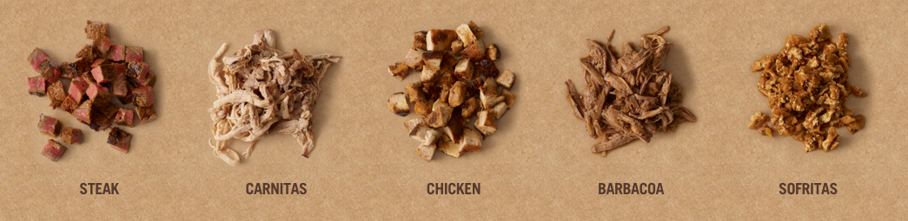
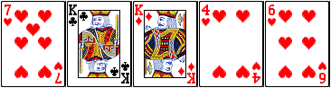
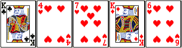
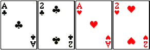
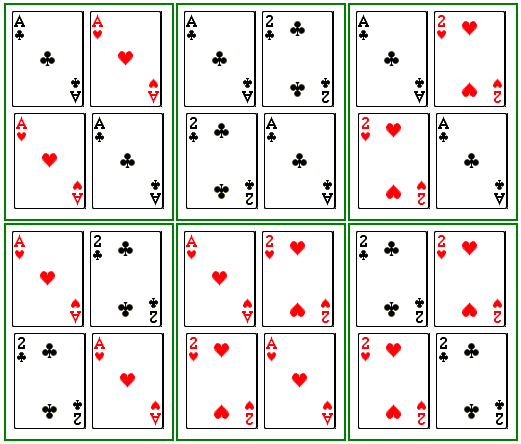

# An Introduction to Counting and Probability for Javascript Developers

### Introduction: Who Cares?

[This guy](http://www.skorks.com/2010/03/you-dont-need-math-skills-to-be-a-good-developer-but-you-do-need-them-to-be-a-great-one/). And you should, too!

### Prerequisites

You should be familiar with big-O notation before working through this material. If you're not, check out the relevant material in the [computer science curriculum](https://github.com/gSchool/computer-science-curriculum).

### Objectives

By the end of this workshop, you should be able to:

* State the Fundamental Counting Principle
* Apply the Fundamental Counting Principle to simple counting problems
* Know the difference between a permutation and a combination, and be able to calculate with both

### Warmup

Consider the following function. What does it do, and what is its big-O complexity?

```js
function multiplicationStatements(n) {
  for (var i = 0; i < n; i++) {
    for (var j = 0; j < n; j++) {
      console.log(`${i} * ${j} is equal to ${i * j}.`);
    }
  }
}
```

The nested for-loop may tip you off that this function is O(_n_<sup>2</sup>). But can you explain _why_ nested for loops of length _n_ typically yield a complexity of O(_n_<sup>2</sup>)? The answer lies in the grandiosely-named Fundamental Counting Principle.

### Fundamental Counting Principle

Roughly speaking, the Fundamental Counting Principle states that if there are _n_ ways to do one thing, and there are _m_ ways to do another thing, then there are _n_ * _m_ ways to do the first thing and the second thing. 

Here's an example: at Chipotle, there are six different dishes you can order: a burrito, a bowl, a salad, crispy corn tacos, soft corn tacos, and soft flour tacos:


For each of these, you can also choose one of five different proteins: steak, carnitas, chicken, barbacoa, and sofritas: 



This means that altogether there are 6 * 5 = 30 lunch options from among these choices. 

**EXERCISE** List out all 30 options.

In the same way, in our function `multiplicationStatements(n)` above, there are `n` possible values for `i` and `n` possible values for `j`. So, by the Fundamental Counting Principle, there are `n * n` possible values for the pair `(i,j)`. 

So far, we've only talked about the Fundamental Counting Principle as it pertains to pairs of options, but it can be extend to an arbitrary number of collections. Returning to our Chipotle example, not only can you choose the type of dish and the protein, you can also choose the type of rice (either brown or white) and the type of beans (black or brown). So, between the number of dishes (6), the number of proteins (5), the number of rice types (2), and the number of bean types (2), this gives a total of 6 * 5 * 2 * 2 = 120 different lunch options.

In general, if you have _n_<sub>1</sub> options for your first choice, _n_<sub>2</sub> options for your second choice, ... , and _n_<sub>k</sub> options for your _k_<sup>th</sup> choice, the Fundamental Counting Principle tells us that you will have _n_<sub>1</sub> * _n_<sub>2</sub> * ... * _n_<sub>k</sub> options in all.

**EXERCISE** 

Use the Fundamental Counting Principle to determine the complexity of each of the following functions:

```js
function moreMultiplicationStatements(n) {
  for (var i = 0; i < n; i++) {
    for (var j = 0; j < n; j++) {
      for (var k = 0; k < n; k++) {
        console.log(`${i} * ${j} * ${k} is equal to ${i * j * k}.`);
      }
    }
  }
}
```

```js
function moreMultiplicationStatements(n) {
  for (var i = 0; i < n; i++) {
    for (var j = 0; j < n*n; j++) {
      for (var k = 0; k < Math.sqrt(n); k++) {
        console.log(`${i} * ${j} * ${k} is equal to ${i * j * k}.`);
      }
    }
  }
}
```

```js
function moreMultiplicationStatements(n,m,l) {
  for (var i = 0; i < n; i++) {
    for (var j = 0; j < m; j++) {
      for (var k = 0; k < l; k++) {
        console.log(`${i} * ${j} * ${k} is equal to ${i * j * k}.`);
      }
    }
  }
}
```

### Permutations

Once you know about the Fundamental Counting Principle, you can begin to count more complicated sets of objects. 

One common counting problem is to count the number of _permutations_, or rearrangements, of som set of numbers. For example, consider the array `[1, 2, 3]`. There are six permutations of this array:

```js
[1, 2, 3]
[1, 3, 2]
[2, 1, 3]
[2, 3, 1]
[3, 1, 2]
[3, 2, 1]
```

Where does the number 6 come from? To answer this, let's use the Fundamental Counting Principle! There are three values we can choose for the first element of the array - 1, 2, 3. Once we've chosen that first element, we have two options for the second element of the array; for instance, if we say the first element will be 2, then the second element can be either 1 or 3. Finally, once we've chosen the second element, there is only one choice left for the value of the third element: if we say the first element will be 2, and the second element will be 3, then the last element must be 1, since that's the only value remaining.

In other words, but the fundamental counting principle, the number of permutations of the above array is 3 * 2 * 1 = 6.

Of course, this can be generalized to an array of any size. In general, we have the following fact:

**Fact:** The number of permutations of a set of _n_ elements is n * (n - 1) * (n - 2) * ... * 3 * 2 * 1 = n!

**Same Fact, Javascript-Developer-Friendly version:** the number of permutations of an array with _n_ distinct elements is n!.

**EXERCISE**

1. How many premutations of the array `[1, 2, 3, 4]` are there? List them all.
2. How many permutations of the array `[1, 2, 3, 4, 5, 6, 7, 8, 9, 10]` are there? Why would it be impractical to list them all out?

**EXERCISE (Bonus!)** Complete [this kata](http://www.codewars.com/kata/permutations-of-an-array-and-associated-values), which requires some knowledge of permutations. Or [this one](http://www.codewars.com/kata/permutations).

**Note**: Permutations are a useful way to think about [bogo sort](https://en.wikipedia.org/wiki/Bogosort). In bogosort, you take a random permutation of your array, check if it's sorted; if it is, you return the sorted array, and if not, you take another random permutation. So, if the array has length _n_ and has all distinct elements, there's only 1 permutation that is sorted out of n! permutations, which means the probability that any one permutation will be the sorted one is only 1/_n_!.

### Combinations

How many ways are there to draw a 5-card hand from a deck of 52 cards? Given what you know about permutations, you might be tempted to say that the answer is 52 * 51 * 50 * 49 * 48 = 311,875,200. This is because you have 52 options for your first card, then 51 options for your second (every card is available except your first card), 50 options for your third (every card is available except your first two cards), and so on. However, typically the order of the cards in your hand doesn't matter. This hand:



is the same as this hand:



because the cards are the same, they've just been rearranged.

So again: how many ways are there to draw a 5-card hand from a deck fo 52 cards? Since we don't care about permutations of a given hand, we need to _divide_ the 311,875,200 by the number of permutations of five cards. The number of permutations of five cards is 5! = 120, so this means the total number of hands is 311,875,200 / 120 = 2,598,960.

Confused? Let's take a quick look at a simpler example: suppose we have a deck with only four cards: an ace of clubs (AC), a two of clubs (2C), an ace of hearts (AH), and a two of hearts (2H):



How many ways are there to make a 2-card hand from this deck?

The answer isn't 4 * 3 = 12, since the order of the cards don't matter. Here are all 12 possibilities, arranged by hand:



As you can see, those 12 arrangements of 2 cards fit in to 12/2 = 6 different hands, each one with 2 permutations in it (corresponding to the 2 permutations of a set of 2 cards).

In general, the number of combinations of *k* elements from a set of *n* elements is equal to n * (n - 1) * ... * (n - k + 1)/k!. Or, to put it another way, as n!/((n-k)!*k!). This is sometimes written as <sub>_n_</sub>_C_<sub>_k_</sub>. For more on these values (also known as Binomial coefficients), check out [this article](https://en.wikipedia.org/wiki/Binomial_coefficient).

### Poker!

Let's apply what we've learned about combinations to the game of Poker. Well, a simplified version of Poker anyway. Consider the following scenario: you're dealt 5 cards from a deck of 52. You may recall that every card has a suit (Club (&clubs;), Diamond (&diams;), Heart (&hearts;), or Spade (&spades;)), and a value (**A**ce, **2**, **3**, **4**, **5**, **6**, **7**, **8**, **9**, **10**, **J**ack, **Q**ueen, or **K**ing). You want to know how likely it is that you're dealt one of any number of favorable poker hands.

Here's a list of all the types of hands you can be dealt:

| Hand | Description | Example|
| --- | --- | --- |
| Royal Flush | A straight flush where the lowest value card is 10 | 10&hearts;, J&hearts;, Q&hearts;, K&hearts;, A&hearts;|
| Straight Flush | A straight and a flush (but not a royal flush) | 3&diams;, 4&diams;, 5&diams;, 6&diams;, 7&diams; |
| Four of a Kind | Four cards have the same value | 6&hearts;, 6&diams;, 6&clubs;, 6&spades;, J&hearts; |
| [Full House](https://www.youtube.com/watch?v=agZ0qQ8lYDk) | A three of a kind and a pair | 4&diams;, 4&clubs;, 4&spades;, Q&hearts;, Q&diams; |
| Flush | All cards have the same suit (but not a straight) | 2&clubs;, 5&clubs;, 8&clubs;, 9&clubs;, J&clubs; |
| Straight | Cards are sequential (but not a flush) | 4&clubs;, 5&diams;, 6&diams;, 7&hearts;, 8&clubs; |
| Three of a Kind | Exactly Three cards have the same value (but not a full house) | 8&diams;, 8&clubs;, 8&spades;, 4&diams;, A&spades; |
| Two Pair | Exactly two pairs of cards have the same value | A&clubs;, A&hearts;, 6&diams;, 6&clubs;, J&spades; |
| One Pair | Exactly two cards have the same value | 2&diams;, 2&clubs;, 7&diams;, 8&spades;, Q&clubs; |

Supposed you're asked with determining in how many ways one could obtain each of these hands. There are a few ways you could go about this task:

1. Programatically, deterministic: write a program to generate all possible poker hands, then check each hand for whether it falls into any of the categories above. This approach will work, though debugging a list of nearly 3 million poker hands to make sure your code is correct is, to say the least, non-trivial. 
2. Programatically, probabalistic: Write some code to draw a hand at random, check whether it is any of the hands in the table, then rinse and repeat millions of times. Implementation here is simpler, but you'll need a really large number of trials to get good estimates for the likelihood of being dealt the rare hands (e.g. a royal flush).
3. Mathematically! Determining the likelihood for these hands is really just a sequence of counting exercises. 

For example, to get a full house, you have <sub>13</sub>_C_<sub>1</sub> = 13 ways to choose a value for the three-of-a-kind, and <sub>4</sub>_C_<sub>3</sub> = 4 ways to choose the three suits from among the four total. Next, there are <sub>12</sub>_C_<sub>1</sub> = 12 ways to choose a value for the pair (since the value can't be the same as the value for the three-of-a-kind), and there are <sub>4</sub>_C_<sub>2</sub> = 6 ways to choose the two suits from among the four total. Therefore, by the fundamental counting principle, there are 13 * 4 * 12 * 6 = 3.744 ways to get dealt a full house. Since there are <sub>52</sub>_C_<sub>5</sub> = 2,598,960 different poker hands, this means the probability of getting dealt a full house is 3,744/2,598,960, or around 0.14%.

**EXERCISES**

1. Use math to calculate the likelihood of being dealt each of the remaining hands in the table.
2. (Bonus!) Use a deterministic program to verify your math results.
3. (Bonus!) Use a probabilistic program to verify your math results.

### Resources

[Math.js](http://mathjs.org/)

[JS-Combinatorics (node module)](https://www.npmjs.com/package/js-combinatorics)